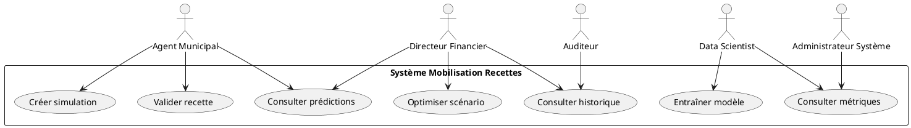
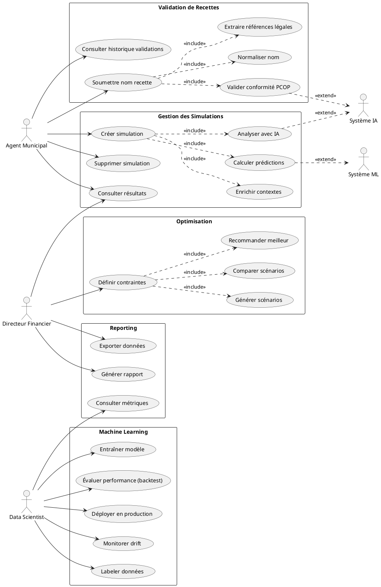
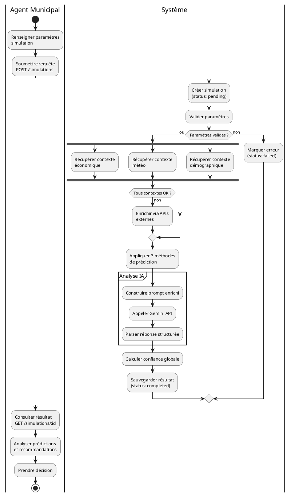
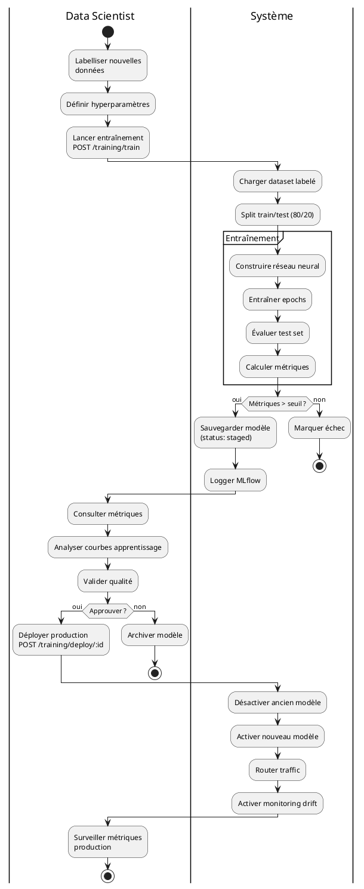

# Documentation Fonctionnelle - Backend Mobilisation Recettes Locales

## Table des matières

1. [Présentation générale](#1-présentation-générale)
2. [Acteurs du système](#2-acteurs-du-système)
3. [Diagramme de cas d'utilisation UML](#3-diagramme-de-cas-dutilisation-uml)
4. [Fonctionnalités principales](#4-fonctionnalités-principales)
5. [Scénarios d'usage détaillés](#5-scénarios-dusage-détaillés)
6. [Workflows métier](#6-workflows-métier)
7. [Règles de gestion](#7-règles-de-gestion)
8. [Exemples concrets](#8-exemples-concrets)
9. [Interfaces utilisateur (API)](#9-interfaces-utilisateur-api)
10. [Rapports et exports](#10-rapports-et-exports)

---

## 1. Présentation générale

### 1.1 Objectif du système

Le système **Backend Mobilisation Recettes Locales** est une plateforme d'aide à la décision pour les **municipalités malgaches** visant à :

1. **Prédire les revenus fiscaux** futurs avec des méthodes quantitatives rigoureuses
2. **Simuler différents scénarios** de collecte de recettes
3. **Valider la conformité légale** des types de recettes proposées
4. **Optimiser les stratégies** de mobilisation des ressources locales
5. **Analyser intelligemment** les données via IA générative

### 1.2 Contexte métier

**Problématique** :
Les communes malgaches ont du mal à prévoir leurs revenus fiscaux et à identifier les recettes légales qu'elles peuvent collecter selon le **PCOP 2006 CTD** (Plan Comptable des Organismes Publics) et le **Code des Impôts LFI 2025**.

**Solution apportée** :
- Prédictions basées sur **3 méthodes quantitatives** (régression linéaire, réseau de neurones, analyse saisonnière)
- Validation automatique des recettes via **IA (Google Gemini)**
- Enrichissement contextuel (météo, économie, démographie)
- Backtesting pour évaluer la fiabilité des modèles

### 1.3 Bénéfices attendus

| Bénéficiaire | Avantage |
|--------------|----------|
| **Municipalités** | Prévisions budgétaires précises, identification recettes légales |
| **Agents fiscaux** | Normalisation des noms de recettes, conformité PCOP/LFI |
| **Décideurs** | Scénarios comparatifs, recommandations IA, optimisation |
| **Data Scientists** | Entraînement/déploiement modèles, backtesting, drift monitoring |
| **Auditeurs** | Traçabilité complète, logs d'audit, références légales |

---

## 2. Acteurs du système



### 2.1 Description des acteurs

| Acteur | Rôle | Permissions |
|--------|------|-------------|
| **Agent Municipal** | Saisit les simulations, valide les recettes | Lecture/Écriture simulations, validations |
| **Directeur Financier** | Consulte prédictions, demande optimisations | Lecture toutes données, optimisation |
| **Data Scientist** | Entraîne et déploie modèles ML | Gestion modèles, backtest, métriques |
| **Administrateur Système** | Configure infra, surveille performance | Accès complet, monitoring |
| **Auditeur** | Vérifie conformité, consulte logs | Lecture seule complète, historique |

---

## 3. Diagramme de cas d'utilisation UML



---

## 4. Fonctionnalités principales

### 4.1 Module Simulation de Revenus

**Objectif** : Créer des simulations de collecte de revenus fiscaux avec prédictions quantitatives.

**Fonctionnalités** :
- ✅ Création simulation avec paramètres (ville, types recettes, horizon temporel)
- ✅ Enrichissement automatique des contextes (météo, économie, démographie)
- ✅ Calcul de 3 prédictions quantitatives (linéaire, neural, saisonnière)
- ✅ Analyse intelligente par IA (Gemini) avec recommandations
- ✅ Calcul de confiance globale (0-1)
- ✅ Consultation des résultats avec interprétation
- ✅ Suppression des simulations obsolètes

**Règles métier** :
- Une simulation doit avoir au minimum 1 type de recette
- L'horizon de prédiction est limité à 24 mois
- Si les contextes sont manquants, le système les récupère automatiquement
- La confiance globale est la moyenne des confiances individuelles

### 4.2 Module Validation de Recettes

**Objectif** : Valider qu'un nom de recette proposé est conforme au PCOP 2006 et au Code des Impôts LFI 2025.

**Fonctionnalités** :
- ✅ Soumission d'un nom de recette (ex: "taxe marché")
- ✅ Validation automatique via IA (Gemini)
- ✅ Normalisation du nom selon PCOP
- ✅ Extraction des références légales (articles, sections)
- ✅ Classification (valide, invalide, ambiguë)
- ✅ Description structurée (base légale, assiette, taux, modalités)
- ✅ Historique des validations par municipalité

**Statuts possibles** :
- `valid` : Recette conforme, nom normalisé
- `invalid` : Recette non conforme au cadre légal
- `ambiguous` : Plusieurs correspondances possibles
- `pending` : En attente de traitement
- `error` : Erreur technique lors de la validation

### 4.3 Module Prédiction Quantitative

**Objectif** : Fournir 3 méthodes de prédiction indépendantes pour robustesse.

**Méthodes implémentées** :

#### 4.3.1 Régression Linéaire
- Formule : `Revenue = α × Population + β × GDP + γ × Time + ε`
- Basée sur corrélations historiques
- Rapide et interprétable

#### 4.3.2 Réseau de Neurones (TensorFlow.js)
- Architecture : 2 couches cachées [8, 4 neurones]
- Features : population, PIB, saison, type recette, météo
- Entraînement ad-hoc ou modèle pré-entraîné
- Capture interactions non-linéaires

#### 4.3.3 Analyse Saisonnière
- Moyennes mobiles sur 3-6 mois
- Facteurs saisonniers (saison sèche/humide)
- Ajustement par type de recette
- Prise en compte des variations cycliques

**Agrégation** :
```
Prediction_final = (Linear + Neural + Seasonal) / 3
Confidence = 1 - std([Linear, Neural, Seasonal]) / mean
```

### 4.4 Module Optimisation

**Objectif** : Trouver le meilleur scénario de collecte selon contraintes.

**Fonctionnalités** :
- ✅ Définition de contraintes (budget min/max, types recettes prioritaires)
- ✅ Génération de N scénarios alternatifs
- ✅ Simulation de chaque scénario
- ✅ Comparaison multi-critères (montant, faisabilité, risque)
- ✅ Recommandation du meilleur scénario

**Critères d'optimisation** :
- Maximiser revenus totaux
- Minimiser variance (risque)
- Respecter contraintes légales
- Équilibrer types de recettes

### 4.5 Module Machine Learning

**Objectif** : Entraîner, évaluer et déployer des modèles prédictifs personnalisés.

**Fonctionnalités** :
- ✅ Labellisation de données (manuel + IA)
- ✅ Entraînement de modèles avec hyperparamètres configurables
- ✅ Backtesting sur données historiques
- ✅ Calcul de métriques (RMSE, MAE, MAPE, R²)
- ✅ Déploiement en production (versioning)
- ✅ Monitoring de drift (dégradation performance)
- ✅ Rollback automatique si drift critique

**Workflow ML** :
1. Labellisation → 2. Entraînement → 3. Évaluation → 4. Staging → 5. Validation manuelle → 6. Production → 7. Monitoring

### 4.6 Module Monitoring

**Objectif** : Surveiller la santé du système et la performance des modèles.

**Métriques collectées** :
- Durée des prédictions par méthode
- Taux de succès/échec API
- Utilisation cache IA
- Tokens consommés (Gemini)
- Latence base de données
- Drift des modèles ML
- Alertes critiques

**Export** : Format Prometheus (`/metrics`)

---

## 5. Scénarios d'usage détaillés

### 5.1 Scénario 1 : Agent créé une simulation simple

**Acteur** : Agent Municipal de Antananarivo  
**Objectif** : Prévoir les revenus IFPB pour les 6 prochains mois

**Étapes** :
1. Agent accède à l'interface API
2. Soumet une requête POST `/serviceprediction/simulations` :
   ```json
   {
     "parameters": {
       "city": "Antananarivo",
       "recipe_types": ["IFPB"],
       "horizon": 6,
       "seasons": ["dry"]
     },
     "municipalityId": "antananarivo-001"
   }
   ```
3. Système crée la simulation (status: pending)
4. Système récupère automatiquement les contextes (météo, économie, démographie)
5. Système applique 3 méthodes de prédiction en parallèle
6. TensorFlow service retourne prédiction neural
7. Système agrège les 3 résultats
8. Système appelle Gemini pour analyse intelligente
9. Gemini retourne interprétation + recommandations
10. Système sauvegarde résultat (status: completed)
11. Agent consulte GET `/serviceprediction/simulations/{id}`
12. Agent obtient :
    - Prédictions : Linear +6.2%, Neural +7.5%, Seasonal +7.0%
    - Interprétation IA : "Convergence forte vers +6-8%, signal positif"
    - Confiance : 87%

**Résultat** : Simulation complète en ~10 secondes, décision éclairée.

### 5.2 Scénario 2 : Validation d'une recette inconnue

**Acteur** : Agent Municipal de Toliara  
**Objectif** : Vérifier si "Taxe parking communal" est une recette légale

**Étapes** :
1. Agent soumet POST `/serviceprediction/revenue-validation` :
   ```json
   {
     "original_name": "Taxe parking communal",
     "municipality_id": "toliara-001"
   }
   ```
2. Système interroge Gemini avec prompt enrichi (PCOP + LFI 2025)
3. Gemini analyse et répond :
   ```json
   {
     "name": "Redevances pour stationnement sur la voie publique",
     "status": "valid",
     "description": "- Base légale : Code Général art. 234...",
     "pcop_reference": {"classe": "7", "chapitre": "703"}
   }
   ```
4. Système sauvegarde dans `revenue_validation`
5. Agent reçoit nom normalisé + références légales

**Résultat** : Recette validée et normalisée en 3 secondes.

### 5.3 Scénario 3 : Optimisation multi-recettes

**Acteur** : Directeur Financier de Fianarantsoa  
**Objectif** : Trouver la meilleure combinaison de 3 recettes pour maximiser revenus

**Étapes** :
1. Directeur soumet POST `/serviceprediction/optimize` :
   ```json
   {
     "municipalityId": "fianarantsoa-001",
     "constraints": {
       "minRevenue": 50000,
       "maxEffort": "medium",
       "recipeTypes": ["IFPB", "taxe_marché", "amendes"]
     },
     "scenarios": 5
   }
   ```
2. Système génère 5 scénarios alternatifs
3. Pour chaque scénario, système crée simulation interne
4. Système compare résultats :
   - Scénario 1 : IFPB 60%, marché 30%, amendes 10% → 58K
   - Scénario 2 : IFPB 50%, marché 40%, amendes 10% → 62K ⭐
   - Scénario 3 : IFPB 70%, marché 20%, amendes 10% → 55K
   - ...
5. Système recommande Scénario 2 (max revenus, risque modéré)
6. Directeur obtient rapport détaillé avec justifications IA

**Résultat** : Optimisation en 30 secondes, gain +12% vs scénario initial.

### 5.4 Scénario 4 : Backtest d'un modèle ML

**Acteur** : Data Scientist  
**Objectif** : Évaluer la performance d'un nouveau modèle neural sur 2023

**Étapes** :
1. DS soumet POST `/serviceprediction/backtest/run` :
   ```json
   {
     "modelName": "neural_v2",
     "startDate": "2023-01-01",
     "endDate": "2023-12-31"
   }
   ```
2. Système charge données réelles 2023
3. Pour chaque mois, système prédit avec `neural_v2`
4. Système compare prédictions vs réalité
5. Système calcule métriques :
   - RMSE : 2150 (acceptable < 3000)
   - MAE : 1800
   - MAPE : 4.2% (excellent)
   - R² : 0.89
6. DS consulte résultats GET `/serviceprediction/backtest/results/{id}`
7. DS visualise courbe prédictions vs réel
8. DS décide de déployer le modèle

**Résultat** : Modèle validé, déploiement en production.

### 5.5 Scénario 5 : Détection de drift et rollback

**Acteur** : Système (automatique)  
**Objectif** : Détecter dégradation modèle et revenir à version stable

**Étapes** :
1. Système monitore métriques en temps réel
2. Modèle `neural_v2` en production depuis 3 mois
3. Système détecte :
   - MAPE passe de 4.2% → 8.5% (seuil = 7%)
   - RMSE passe de 2150 → 4200
4. Système crée alerte `DriftAlert` (severity: HIGH)
5. Système notifie DS par webhook
6. Si drift critique (MAPE > 10%), système rollback automatique
7. Système réactive `neural_v1` (dernière version stable)
8. DS analyse logs, re-entraîne modèle avec nouvelles données

**Résultat** : Service dégradé < 5 minutes, restauration automatique.

---

## 6. Workflows métier

### 6.1 Workflow : Cycle de vie d'une simulation



### 6.2 Workflow : Validation de recette fiscale

```plantuml
@startuml

|Agent Municipal|
start
:Identifier recette\nà valider;
:Soumettre nom\nPOST /revenue-validation;

|Système|
:Enregistrer requête\n(status: pending);
:Vérifier cache;

if (Cache hit ?) then (oui)
  :Retourner résultat\ncaché;
else (non)
  
  partition "Validation IA" {
    :Construire prompt\n(PCOP + LFI 2025);
    :Appeler Gemini API;
    :Recevoir analyse structurée;
    :Parser JSON;
  }
  
  :Déterminer statut\n(valid/invalid/ambiguous);
  
  if (Statut ?) then (valid)
    :Extraire nom normalisé;
    :Extraire références légales;
  else (invalid)
    :Message erreur détaillé;
  else (ambiguous)
    :Lister options possibles;
  endif
  
  :Sauvegarder validation\nen BDD;
  :Mettre en cache (1h);
  
endif

|Agent Municipal|
:Recevoir résultat;

if (Statut = valid ?) then (oui)
  :Utiliser nom normalisé\ndans système comptable;
else (ambiguous)
  :Choisir manuellement\nparmi options;
else (invalid)
  :Abandonner recette;
endif

stop

@enduml
```

### 6.3 Workflow : Entraînement et déploiement modèle ML



---

## 7. Règles de gestion

### 7.1 Règles métier globales

| ID | Règle | Justification |
|----|-------|---------------|
| **RG01** | Une simulation doit contenir au minimum 1 type de recette | Prédiction impossible sans recette ciblée |
| **RG02** | L'horizon de prédiction est limité à 24 mois | Fiabilité décroît au-delà |
| **RG03** | Les contextes manquants sont enrichis automatiquement | Automatisation pour simplifier saisie |
| **RG04** | Une validation avec nom identique utilise le cache (1h TTL) | Éviter appels IA redondants |
| **RG05** | Un modèle avec MAPE > 10% ne peut être déployé | Garantir qualité minimale |
| **RG06** | Le drift critique (MAPE > 15%) déclenche rollback automatique | Protection contre dégradation |
| **RG07** | Les prédictions négatives sont ramenées à 0 | Revenus négatifs impossibles |
| **RG08** | La confiance globale = 1 - (std / mean) des 3 méthodes | Mesure convergence |

### 7.2 Règles de validation

| Champ | Règle | Exemple valide | Exemple invalide |
|-------|-------|----------------|------------------|
| `city` | Chaîne non vide, ville malgache | "Antananarivo" | "" |
| `recipe_types` | Array non vide, max 10 types | ["IFPB", "taxe_marché"] | [] |
| `horizon` | Entier entre 1 et 24 | 12 | 36 |
| `municipality_id` | UUID ou code ville | "antananarivo-001" | "ABC" |
| `original_name` | Chaîne non vide, max 255 car. | "Taxe marché" | (null) |

### 7.3 Règles de calcul

**Confiance globale** :
```
Soit P = [P_linear, P_neural, P_seasonal]
Confidence = 1 - (std(P) / mean(P))
Si std(P) / mean(P) > 0.3 → confidence = "low"
```

**Agrégation prédictions** :
```
P_final = (P_linear + P_neural + P_seasonal) / 3
Si P_final < 0 → P_final = 0
```

**MAPE (Mean Absolute Percentage Error)** :
```
MAPE = (1/n) × Σ |Actual - Predicted| / Actual × 100
```

---

## 8. Exemples concrets

### 8.1 Exemple 1 : Simulation complète avec analyse IA

**Requête** :
```bash
POST /serviceprediction/simulations
Content-Type: application/json

{
  "parameters": {
    "city": "Antananarivo",
    "recipe_types": ["IFPB", "taxe_marché"],
    "seasons": ["dry", "wet"],
    "horizon": 12
  },
  "municipalityId": "antananarivo-001"
}
```

**Réponse** (après enrichissement) :
```json
{
  "id": "550e8400-e29b-41d4-a716-446655440000",
  "status": "completed",
  "predictions": {
    "linear": {
      "method": "linear_regression",
      "growthRate": 0.062,
      "confidence": 0.78,
      "formula": "Revenue = 1.2 × Population + 0.8 × GDP + 0.05 × Time"
    },
    "neural": {
      "method": "tensorflow_neural_network",
      "growthRate": 0.075,
      "confidence": 0.85,
      "layers": [8, 4],
      "epochs": 50
    },
    "seasonal": {
      "method": "seasonal_analysis",
      "growthRate": 0.070,
      "confidence": 0.80,
      "seasonalFactor": 1.15
    },
    "average": 0.069,
    "globalConfidence": 0.87
  },
  "analysis": {
    "interpretation": "Les trois méthodes convergent vers une croissance de +6-8% sur 12 mois. La régression linéaire identifie un effet démographique (+1.5% population), le réseau de neurones détecte un multiplicateur saisonnier favorable en saison sèche (+15%), et l'analyse saisonnière confirme une tendance haussière stable. Signal fort de croissance soutenable.",
    "recommendations": [
      "Renforcer la collecte IFPB en Q1-Q2 (saison sèche)",
      "Augmenter fréquence marchés en période haute",
      "Cibler quartiers à forte croissance démographique"
    ],
    "risks": [
      "Volatilité météo en saison humide (-10% possible)",
      "Dépendance à la conformité des contribuables"
    ],
    "confidence": 0.87
  },
  "contexts": {
    "economic": {"gdpGrowth": 0.045, "inflation": 0.06},
    "weather": {"season": "dry", "avgRainfall": 45},
    "demographic": {"population": 1500000, "growthRate": 0.015}
  },
  "createdAt": "2025-12-03T10:30:00Z",
  "completedAt": "2025-12-03T10:30:12Z"
}
```

**Interprétation** :
- 3 prédictions convergent (bon signe)
- Confiance élevée (87%)
- Recommandations actionnables
- Risques identifiés

### 8.2 Exemple 2 : Validation recette invalide

**Requête** :
```bash
POST /serviceprediction/revenue-validation
Content-Type: application/json

{
  "original_name": "Taxe sur les ovnis",
  "municipality_id": "toliara-001"
}
```

**Réponse** :
```json
{
  "name": null,
  "status": "invalid",
  "description": "ERREUR : La recette « Taxe sur les ovnis » ne correspond à aucune recette fiscale ou non fiscale prévue par le Code Général des Impôts de Madagascar (LFI 2025) ni par le Plan Comptable des Organismes Publics (PCOP 2006 CTD). Aucune base légale n'autorise une telle taxation.\n\nRECOMMANDATION : Consultez les recettes légales : Impôts directs locaux (IFPB, IFTB), Taxes indirectes (taxe véhicules), Redevances (marchés, halles), Amendes.",
  "municipality_id": "toliara-001"
}
```

**Interprétation** :
- Recette non conforme
- Nom non normalisé (null)
- Explication claire de l'erreur
- Recommandations alternatives

### 8.3 Exemple 3 : Backtest avec métriques

**Requête** :
```bash
POST /serviceprediction/backtest/run
Content-Type: application/json

{
  "modelName": "neural_v2",
  "startDate": "2023-01-01",
  "endDate": "2023-12-31",
  "municipalityId": "antananarivo-001"
}
```

**Réponse** :
```json
{
  "id": "backtest-123",
  "modelName": "neural_v2",
  "period": {
    "start": "2023-01-01",
    "end": "2023-12-31"
  },
  "metrics": {
    "rmse": 2150.45,
    "mae": 1802.30,
    "mape": 4.18,
    "r2": 0.89,
    "accuracy": 0.92
  },
  "summary": {
    "totalPredictions": 12,
    "successfulPredictions": 11,
    "avgError": 1802.30,
    "maxError": 3500,
    "minError": 450
  },
  "visualization": {
    "actualValues": [50000, 52000, 48000, 55000, ...],
    "predictedValues": [51200, 51800, 47500, 56200, ...],
    "errors": [1200, -200, -500, 1200, ...]
  },
  "conclusion": "Le modèle neural_v2 démontre une excellente performance avec un MAPE de 4.18% et un R² de 0.89. Les erreurs sont majoritairement < 5%, ce qui est acceptable pour des prédictions fiscales. Recommandation : DÉPLOIEMENT EN PRODUCTION.",
  "createdAt": "2025-12-03T11:00:00Z"
}
```

**Interprétation** :
- MAPE 4.18% → Excellent (< 5%)
- R² 0.89 → Très bon fit
- 11/12 prédictions réussies
- Validation positive pour déploiement

---

## 9. Interfaces utilisateur (API)

### 9.1 Endpoints principaux

#### 9.1.1 Simulations

| Endpoint | Méthode | Description | Authentification |
|----------|---------|-------------|------------------|
| `/serviceprediction/simulations` | POST | Créer simulation | Non requise |
| `/serviceprediction/simulations` | GET | Lister simulations | Non requise |
| `/serviceprediction/simulations/:id` | GET | Détails simulation | Non requise |
| `/serviceprediction/simulations/:id` | DELETE | Supprimer simulation | Non requise |

#### 9.1.2 Validation de recettes

| Endpoint | Méthode | Description |
|----------|---------|-------------|
| `/serviceprediction/revenue-validation` | POST | Valider nom recette |
| `/serviceprediction/revenue-validation/history` | GET | Historique validations |
| `/serviceprediction/revenue-validation/:id` | GET | Détails validation |

#### 9.1.3 Analyse IA

| Endpoint | Méthode | Description |
|----------|---------|-------------|
| `/serviceprediction/analysis/:id/enrich` | POST | Enrichir simulation avec IA |
| `/serviceprediction/analysis/:id` | GET | Consulter analyse |

#### 9.1.4 Machine Learning

| Endpoint | Méthode | Description |
|----------|---------|-------------|
| `/serviceprediction/training/train` | POST | Entraîner nouveau modèle |
| `/serviceprediction/training/models` | GET | Lister modèles |
| `/serviceprediction/training/deploy/:id` | POST | Déployer modèle |
| `/serviceprediction/backtest/run` | POST | Lancer backtest |
| `/serviceprediction/backtest/results` | GET | Résultats backtest |

#### 9.1.5 Optimisation

| Endpoint | Méthode | Description |
|----------|---------|-------------|
| `/serviceprediction/optimize` | POST | Optimiser scénario |

#### 9.1.6 Monitoring

| Endpoint | Méthode | Description |
|----------|---------|-------------|
| `/metrics` | GET | Métriques Prometheus |
| `/drift/alerts` | GET | Alertes drift |

### 9.2 Codes de retour HTTP

| Code | Signification | Usage |
|------|---------------|-------|
| `200 OK` | Succès | GET réussi |
| `201 Created` | Créé | POST réussi (simulation, validation) |
| `400 Bad Request` | Erreur client | Paramètres invalides |
| `404 Not Found` | Non trouvé | Ressource inexistante |
| `500 Internal Server Error` | Erreur serveur | Erreur technique (IA, BDD) |
| `503 Service Unavailable` | Service indisponible | TensorFlow ou Gemini inaccessible |

---

## 10. Rapports et exports

### 10.1 Rapport de simulation (format JSON)

**Structure** :
```json
{
  "reportType": "simulation",
  "simulationId": "...",
  "municipality": "Antananarivo",
  "generatedAt": "2025-12-03T12:00:00Z",
  "summary": {
    "recipeTypes": ["IFPB", "taxe_marché"],
    "horizon": 12,
    "predictedGrowth": 0.069,
    "confidence": 0.87
  },
  "predictions": {...},
  "analysis": {...},
  "contexts": {...},
  "recommendations": [...],
  "risks": [...]
}
```

**Export disponible** : JSON, CSV (via transformation)

### 10.2 Rapport de backtest (format JSON)

**Structure** :
```json
{
  "reportType": "backtest",
  "modelName": "neural_v2",
  "period": {"start": "...", "end": "..."},
  "metrics": {
    "rmse": 2150,
    "mae": 1802,
    "mape": 4.18,
    "r2": 0.89
  },
  "details": {
    "actualValues": [...],
    "predictedValues": [...],
    "errors": [...]
  },
  "conclusion": "...",
  "recommendation": "DEPLOY"
}
```

### 10.3 Export Prometheus

**Format** : Texte brut (format Prometheus)

**Exemple** :
```
# HELP prediction_duration_seconds Duration of predictions
# TYPE prediction_duration_seconds histogram
prediction_duration_seconds_bucket{model="linear",le="0.1"} 45
prediction_duration_seconds_bucket{model="neural",le="2.0"} 120
prediction_duration_seconds_sum{model="linear"} 12.5
prediction_duration_seconds_count{model="linear"} 150

# HELP ai_call_duration_seconds Duration of AI calls
# TYPE ai_call_duration_seconds histogram
ai_call_duration_seconds{provider="gemini",status="success"} 3.2

# HELP model_drift_detected_total Number of drift alerts
# TYPE model_drift_detected_total counter
model_drift_detected_total{model="neural_v2",severity="high"} 2
```

---

## Annexes fonctionnelles

### A. Glossaire métier

| Terme | Définition |
|-------|------------|
| **IFPB** | Impôt Foncier sur la Propriété Bâtie (taxe locale sur immeubles) |
| **PCOP** | Plan Comptable des Organismes Publics (référentiel comptabilité publique) |
| **LFI** | Loi de Finances Initiale (cadre fiscal annuel) |
| **Saison sèche** | Avril à octobre (Madagascar) |
| **Saison humide** | Novembre à mars (Madagascar) |
| **Drift** | Dégradation progressive performance modèle ML |
| **Backtest** | Évaluation modèle sur données historiques |

### B. Références légales

- **Code Général des Impôts Madagascar** (LFI 2025)
- **Plan Comptable des Organismes Publics** (PCOP 2006 CTD)
- **Loi sur les collectivités territoriales décentralisées** (CTD)

### C. Cas d'usage additionnels

**UC01** : Comparer 2 municipalités (benchmarking)  
**UC02** : Exporter données pour analyse Excel  
**UC03** : Générer rapport annuel automatisé  
**UC04** : Alerter si revenus < prévisions (monitoring actif)  
**UC05** : Suggérer nouvelles recettes légales (recommandation IA)

---

**Version** : 1.0.0  
**Date** : 3 décembre 2025  
**Auteur** : Équipe Backend Mobilisation  
**Public cible** : Agents municipaux, Directeurs financiers, Auditeurs
